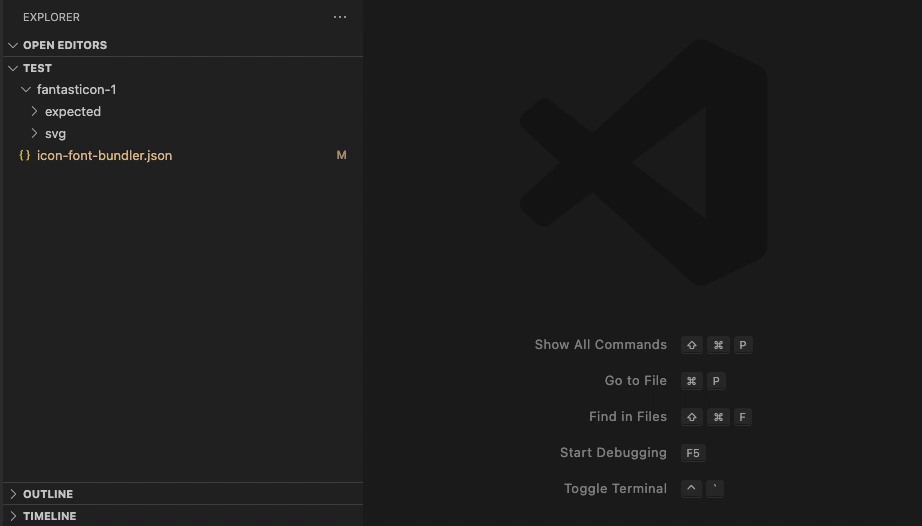

<h1 align="center">IconFontBundler Extension</h1>

Bundle your set of svg into a single font file.

You have a set of **examples** in [test](test) folder.

## Features

- Create **Custom fonts** from a svg set with fantasticon
- **FontAwesome** import bundle from github

## Commands

- `icon-font-bundler.generate`: Generate font | Shortcut: `alt+f alt+f`
- `icon-font-bundler.generateAll`: Generate all fonts| Shortcut: `alt+f alt+a`

### Generate Font

### Generate All Fonts

## Credits

- Fantasticon icon-font generator: [fantasticon](https://github.com/tancredi/fantasticon) - [Tancredi Trugenberger](https://github.com/tancredi)
- [Font-Awesome](https://fontawesome.com/) from [GitHub](https://github.com/FortAwesome/Font-Awesome)